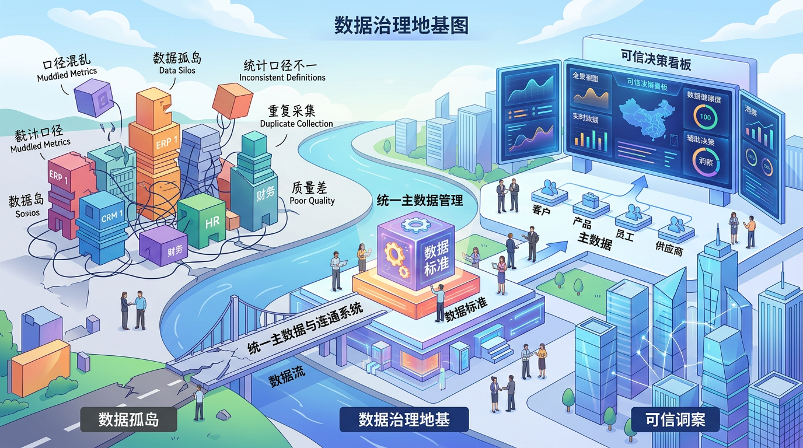

# 政企数字化转型，关键不是“上系统”，而是“能验收”

很多政企数字化项目，问题不在开头，而在结尾。

立项时都很热闹：目标宏大、方案完整、预算到位。
中间也很热闹：平台上线、系统联调、汇报材料一轮接一轮。
真正到验收的时候，气氛就变了。

因为这时候大家都在问同一句话：
**“这些投入，最后到底换来了什么？”**

所以我越来越觉得，政企数字化转型真正的分水岭，不是你上了多少系统、用了多少 AI，而是——
**你有没有做出可验收的经营结果。**

## 1. 一把手不盯结果，项目大概率会跑偏

很多项目一开始是“一把手工程”，推进到一半变成“多部门工程”，到了后期又变成“信息化部门工程”。
责任在转移，目标也在变形。

最后的常见局面是：
技术团队说“我们按需求交付了”，
业务部门说“我们没感受到变化”，
管理层说“先继续优化再看”。

说白了，缺的不是系统，缺的是一个持续盯结果的人。
数字化这件事，一把手如果只在立项和汇报节点出现一次，中间不盯关键指标，项目几乎一定会“做完但不落地”。

## 2. 顺序错了，后面全是补救

最常见的坑，是先买技术，再找场景。
看起来快，实际最慢。

正确顺序应该反过来：
先把业务问题讲清楚，再决定技术怎么配。

至少先回答三个问题：

- 这次转型最想解决的经营问题是什么？
- 谁会因为这次转型真正受益？
- 半年后，用哪几个数字证明这事做成了？

这三问答不清，后面基本都会陷入“系统有了，价值说不明白”。

## 3. 数据治理没打底，AI 只会越做越玄学

有些项目特别爱追新：大模型、智能中台、驾驶舱，概念一个不落。
但底层数据口径还是乱的，业务和财务对同一指标说法都不一样。

这种情况下，系统越多，争议越多。
因为大家不信数据，最终还是回到“谁声音大听谁的”。

所以别把数据治理当成“慢动作”。
它不是装修，它是地基。
地基不稳，上面再高级，最后都得返工。

## 4. 真正有用的转型，都做了流程再设计

很多所谓“流程数字化”，只是把原来的审批搬进了系统。
线下绕三圈，线上照样绕三圈。

有用的做法不是搬家，而是动刀：

- 能删的环节删掉
- 能并的节点并掉
- 能自动的动作自动化
- 异常处理留痕并可追责

流程不改，系统再好也只是记录器。
流程改了，系统才会变成生产力。

## 5. 验收不能后置，必须在立项时就写死

很多项目卡在最后一公里，就是因为前期没人认真定义“验什么”。
到收尾才开始讨论验收标准，通常都会扯皮。

最稳妥的做法很简单，立项当天就定三件事：

- 谁签字
- 看什么指标
- 多久出结果

这三件事先定，后面每一步才有方向。
否则做着做着，项目目标会慢慢变成“别出事就行”。

## 6. 项目交付只是起点，运营能力才是终点

政企数字化最容易犯的错，是把“上线”当“完成”。
实际上，上线只是开始。

真正能持续产生价值的项目，背后都有一套运营机制：
有人盯指标，有人做复盘，有人推动迭代，有预算支持持续优化。

没有运营机制，项目上线即巅峰，三个月后回旧。
这几乎是规律。

## 结语

政企数字化转型，说到底，不是技术竞赛。
它是一次组织能力重构。

你可以不用最新的词，但一定要有最硬的结果。
**能落地、能验收、能复用、能持续，这才叫转型成功。**

---

**来源标注**
- **知识库**：华为 MM 流程与战略落地相关笔记（目标、流程、组织协同、执行闭环）
- **延伸**：结合你业务方法论转译出的“验收前置+运营闭环”框架
- **外部**：本轮未新增外部检索
