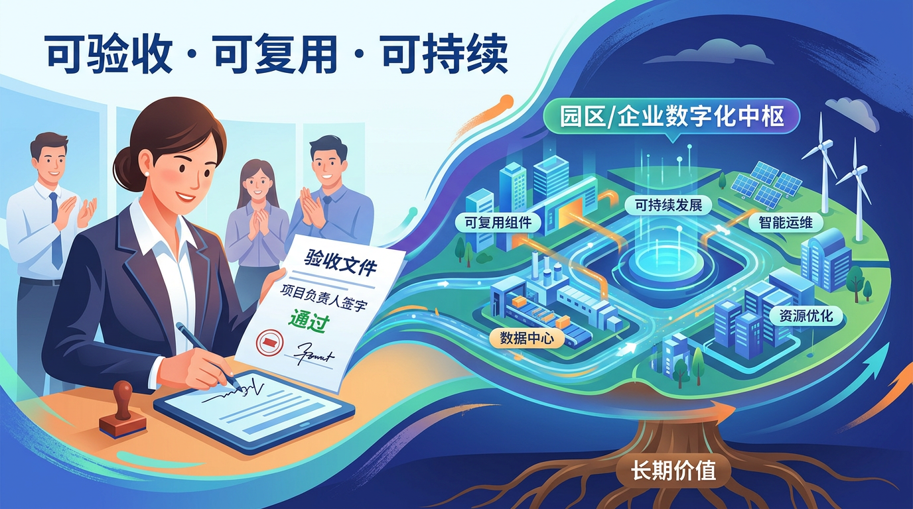

# 政企数字化项目，为什么总卡在“验收前一公里”？

很多政企项目不是死在立项，也不是死在建设，而是死在最后那一公里：验收。

系统看着都有，报表也能导，汇报材料也齐，但一到“能不能签字验收”这一步，现场气氛就变了。因为大家都知道，真正要验的不是“有没有系统”，而是“有没有结果”。

## 一、最常见的误判：把“上线”当“落地”

不少项目把里程碑写成“平台上线”“模型部署完成”“数据中台建成”。这类目标在技术团队内部没问题，但到了业务侧就会变成一句话：**然后呢？**

业务部门更关心的是三件事：

- 周期有没有缩短
- 成本有没有下降
- 风险有没有被提前发现

如果这三件事回答不上来，项目就会进入“技术完成、业务无感”的尴尬区。

## 二、验收卡壳，通常卡在这三个地方

### 1）指标没有前置对齐

立项时写的是“提升智能化水平”，验收时要的是“提升多少、怎么测、谁签字”。

没有在前期把指标定义清楚，后期就只能靠解释。解释越多，验收越慢。

### 2）数据口径没有统一

同一个“产能利用率”，业务系统一套口径，财务系统一套口径，领导驾驶舱又是一套口径。最后不是系统不行，是谁都不敢拿它做决策。

### 3）流程没有闭环责任

问题能看见，告警也能出，但没人对“告警之后怎么处理、多久处理、处理后怎么复盘”负责。系统只能停留在“看板工程”。

## 三、河南场景里，真正跑通的项目都做了同一件事

不管是城投平台、产业园区还是能源类国企，最终能顺利验收的项目，几乎都做了同一件事：

**把“技术交付”改成“经营结果交付”。**

具体做法通常是：

- 先定验收指标，再定系统方案
- 先做关键数据治理，再做大屏和模型
- 先明确流程责任人，再谈自动化比例

## 四、给政企项目负责人的一张“验收倒推表”

如果你正在推进数字化项目，可以用这四问倒推：

1. 这次验收，最终签字人是谁？
2. 签字人最看重的三个指标是什么？
3. 这三个指标分别来自哪套数据口径？
4. 指标异常时，谁在多长时间内闭环处理？

这四问答清楚，项目成功率至少提升一大截。

## 结语

数字化项目真正难的，从来不是“做一个系统”，而是“做一个可以被组织长期使用、并且愿意签字买单的结果”。

所以别再把“上线”当“胜利”。

能被验收、能被复用、能持续产生经营价值，才算真正落地。

---

**来源标注**
- **知识库**：
  - `/opt/openclaw/knowledge/secendME/REG/02-商业观察/10-Notes/2022-08-11-蓝血研究-华为市场管理流程（MM）详解-raw.md`
  - `/opt/openclaw/knowledge/secendME/REG/02-商业观察/10-Notes/2023-04-07-笔记侠-所谓战略，其实就是实现目标的方法和手段-raw.md`
- **延伸**：基于寰曜数能“咨询规划+系统集成+产品+投融资”闭环交付逻辑，转译为验收场景方法论。
- **外部**：无新增外部检索，本稿以知识库与既有业务认知为主。