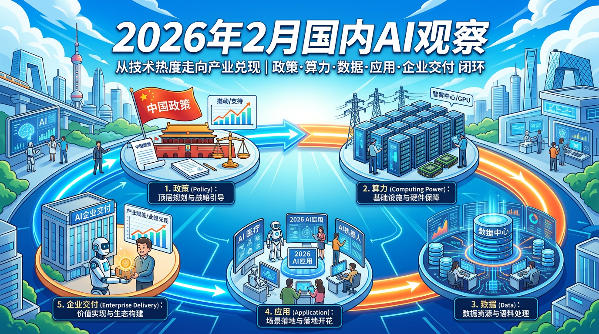

# 2026年2月人工智能行业观察（国内篇）：从“会做模型”到“会交付结果”

2 月的国内 AI，有一个很明显的变化：行业评价标准正在切换。过去大家更关心“谁又发了新模型”，现在更关心“谁能把 AI 变成可验收的业务结果”。这不是热度变化，这是产业进入实战期的信号。

## 事件1：工信相关部署继续强调 6G、脑机接口、具身智能等方向
**基本介绍**：2 月，多条公开信息显示，前沿方向攻关与场景示范仍是政策端的重要主线。  
**评论**：这说明国内 AI 没有走“只做应用快钱”的短线逻辑，而是继续补底层能力。很多前沿赛道短期看不见利润，但长期看，它决定的是产业上限与自主性。今天看似“慢”的投入，往往是未来产业安全感和定价权的来源。

## 事件2：国家数据局推动多地数字经济试验区建设
**基本介绍**：天津、河北（雄安）、上海、江苏、浙江、广东、四川等地围绕数据要素与数字经济机制推进试点。  
**评论**：这类动作没有发布会那么热闹，但对产业最关键。AI 到最后不是拼“有没有模型”，而是拼“有没有可持续的数据供给机制”。数据制度一旦跑通，企业部署 AI 的不确定性会下降，项目从样板间走向规模化会快很多。

## 事件3：生成式 AI 备案与标识规范持续推进
**基本介绍**：2 月，生成式 AI 服务备案和标识机制相关推进仍在持续。  
**评论**：有人把监管理解成阻力，我更愿意把它理解成“修路”。规则清晰，企业反而更敢长期投入，因为边界明确、预期稳定。对行业来说，真正有价值的不是“暂时跑得快”，而是“长期跑得稳”，这点在政企和大规模应用场景里尤其重要。

## 事件4：春节场景中 AI 应用活跃度明显提升
**基本介绍**：春节期间，AI 在内容互动、生活服务、电商等高频场景里的使用显著增加。  
**评论**：这是很关键的拐点：AI 开始从“可体验”走向“可习惯”。用户不是因为新鲜感来一次，而是因为好用反复回来。对企业来说，这意味着竞争开始回到最朴素的商业问题——留存、转化、复购，而不是谁先发一个噱头功能。

## 事件5：国产模型进入“性能+价格+服务”综合竞争
**基本介绍**：2 月，国产模型厂商在能力迭代、调用价格、企业服务形态上持续调整。  
**评论**：这说明行业从“技术冲刺期”进入“经营兑现期”。后面能跑出来的，不一定是最便宜的，也不一定是参数最大的，而是“综合性价比最高、交付最稳、服务最能贴业务”的那批。模型公司会越来越像产业公司，而不是实验室公司。

## 事件6：具身智能与机器人持续破圈
**基本介绍**：2 月，机器人相关展示、话题和落地讨论热度持续走高。  
**评论**：破圈只是第一步，真正的考验是场景复用和成本下降。机器人产业能不能走通，不看一次秀场效果，而看能不能在工业、物流、服务等场景形成连续交付。接下来比的是“稳定性和规模化能力”，不是“惊艳度”。

## 事件7：地方产业基金与专项行动继续密集推出
**基本介绍**：2 月，多地继续发布 AI 产业基金或行动方案，覆盖模型、芯片、机器人、应用等链条。  
**评论**：城市竞争逻辑正在升级：过去比政策优惠，现在比“算力、场景、生态、资本协同”的系统能力。基金只是起点，不是结果。两年后真正见分晓的，是企业留存率、项目转化率和产业链完整度，而不是当下签了多少协议。

## 事件8：超算/智算基础设施持续扩容
**基本介绍**：2 月，超算互联网、智算集群等基础设施建设进展持续释放。  
**评论**：这是最不性感、但最硬核的一层。没有稳定可调度、成本可控的算力网络，应用层很难规模化。很多看似“突然爆发”的 AI 应用，背后其实都靠这层基础设施托底。路修好了，车才跑得快，这个逻辑不会变。

## 当月产业分析（国内）
2026 年 2 月，国内 AI 的整体趋势可以概括为一句话：从“技术热度”转向“产业兑现”。政策端在继续给方向，数据与合规机制在补基础，应用端在高频场景验证真实需求，资本端也在从“讲故事”切到“看交付”。行业评价标准正在变硬：不再只看谁发布快，而看谁能拿出可量化结果、可持续运营和可复制交付能力。未来一段时间，真正有机会穿越周期的团队，往往具备同一种能力——把算力、数据、流程、场景和组织运营串成闭环；反过来，只会堆概念、缺少场景深耕和交付纪律的团队，会越来越难。国内 AI 的下半场已经开始，胜负手不在口号，在验收单。

---

**来源标注**
- 知识库：华为 MM 流程与战略落地相关笔记（用于“目标-执行-验收闭环”分析框架）
- 延伸：基于政企数字化“可交付/可验收”视角的产业解读
- 外部：2026年2月公开行业快讯与媒体报道口径（用于事件观察）
