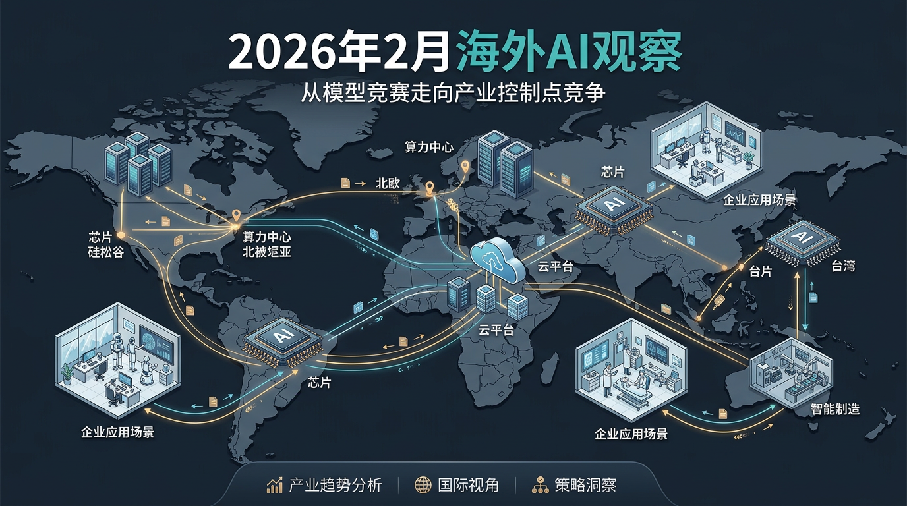
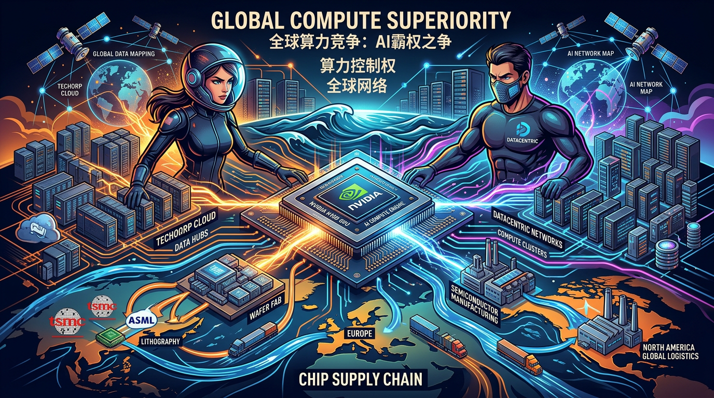

# 2026年2月人工智能行业观察（海外篇）：模型差距在缩小，控制权差距在拉大

2 月看海外 AI，如果只盯模型榜单，你会误判。这个月真正发生的，不是某家公司分数多了两分，而是产业链关键位置在加速固化：谁控芯片，谁控云，谁控分发，谁控合规，谁就控利润。说白了，大家都不再满足于“做出一个厉害模型”，而是要把模型变成一套可持续挣钱的工业系统。

## 事件1：Meta 与 NVIDIA 继续加深长期合作
**基本介绍**：2 月，Meta 与 NVIDIA 的合作信号继续加强，核心仍围绕数据中心扩容、训练与推理资源稳定供给。市场普遍将其理解为“提前锁算力”。  
**评论**：这件事看起来像采购，实际上是生存策略。AI 时代最贵的资产不是模型参数，而是“可持续交付的算力确定性”。Meta 这种动作，本质是在用今天的成本换明天的节奏。因为在这条赛道里，慢半拍不是少赚一点，而是可能直接丢掉下一轮入口位置。

## 事件2：OpenAI 超大规模融资预期持续升温
**基本介绍**：围绕 OpenAI 新一轮大额融资的消息在 2 月持续发酵，关注点从融资本身，转向资金将投向何处（算力、产品、全球部署）。  
**评论**：很多人把融资理解成“资本热闹”，我更愿意把它看成“时间购买器”。大模型公司融资越大，意味着越希望把未来两三年的不确定性提前买成确定性：锁供应、稳人才、抢客户。但这也会带来反向压力——市场会更快要求商业兑现，容错窗口会明显缩短。

## 事件3：OpenAI 与印度产业侧推进本地 AI 基础设施
**基本介绍**：2 月公开信息显示，OpenAI 与印度大型产业集团在本地算力部署方向有更深协同预期。  
**评论**：这不是普通“海外拓展”，这是 AI 全球化进入“区域运营阶段”的标志。过去是“全球一套模型到处跑”，现在是“每个关键市场都要本地算力+本地合规+本地产业伙伴”。谁先把这三件事同时做成，谁就有更高概率把技术优势转成长期营收优势。

## 事件4：Google 与 Sea 在东南亚推进 AI 场景合作
**基本介绍**：Google 与东南亚科技集团 Sea 的合作聚焦电商与游戏业务中的 AI 工具应用。  
**评论**：这类合作的价值在于，它直接把 AI 从“能力展示”拉回到“业务回报”。电商和游戏都是高频场景，用户行为数据密集、反馈周期短，AI 在这里不是“有趣”，而是“能不能提升转化、拉高留存、压低获客成本”。能在这种场景跑通，才算真正进入商业深水区。

## 事件5：欧洲监管继续强化 AI 平台责任
**基本介绍**：2 月，欧洲在平台机制、算法责任、用户保护等议题上持续释放更强监管信号。  
**评论**：监管不是简单“踩刹车”，更像是在重建赛道规则。没有规则，创新跑得快但容易翻车；有规则，短期变慢但长期可持续。对 AI 企业来说，真正的分界线是：你不仅要会做模型，还要会做可解释、可审计、可追责的产品体系。这个能力，未来会直接影响跨区域扩张效率。

## 事件6：半导体与先进设备预期继续被市场放大
**基本介绍**：2 月，围绕先进制程、设备能力和上游供给弹性的讨论持续升温。  
**评论**：AI 的底层始终是半导体工业，不是营销工业。上游设备每一次实质进展，都会传导到训练成本、推理成本和供给节奏。换句话说，应用层能跑多快，最终要看底层“电和路”修得多扎实。忽视这点，很容易高估短期应用爆发、低估中长期供给约束。

## 事件7：海外企业更公开地讨论 AI 对岗位结构的影响
**基本介绍**：2 月，多家海外企业公开谈及 AI 对组织效率与岗位结构的重塑。  
**评论**：这类变化比发布会更真实，因为它直接发生在组织里。技术革命真正落地，从来不是先改口号，而是先改组织。企业开始动岗位、动流程、动预算，说明 AI 已经从“创新项目”变成“经营变量”。后面拼的也不是谁会用，而是谁能把 AI 稳定写进组织的日常动作里。

## 当月产业分析（海外）
2026 年 2 月，海外 AI 产业最核心的变化，是竞争焦点从“模型能力”转向“控制点能力”。模型仍重要，但它已经不是唯一变量。真正决定胜负的，是四件事能不能同时成立：算力供给是否稳定、分发入口是否可控、区域合规是否可执行、商业回报是否可持续。你会看到，头部玩家都在做同一件事——把技术优势转成产业位置优势。接下来半年，应用层还会继续热闹，但价值会更快向平台型公司和少数垂直强者集中，中间层会承受“成本高、议价弱、护城河浅”的三重压力。简单说，海外 AI 已进入“产业结构收敛期”，会做模型是门票，会做经营才是决赛。

---

**来源标注**
- 知识库：华为 MM 流程与战略落地相关笔记（用于“目标-执行-验收闭环”分析框架）
- 延伸：基于政企数字化“可交付/可验收”视角的产业解读
- 外部：2026年2月公开行业快讯与媒体报道口径（用于事件观察）
