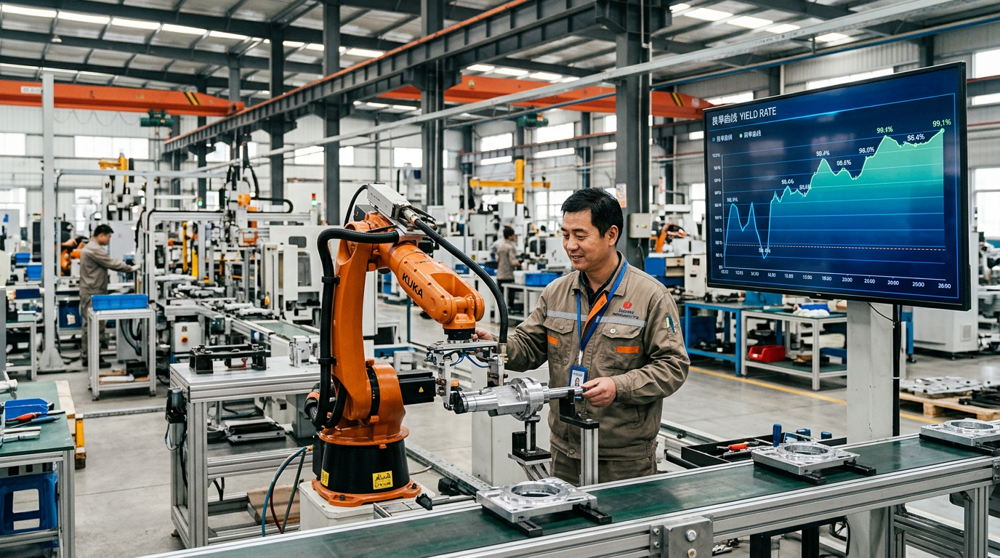
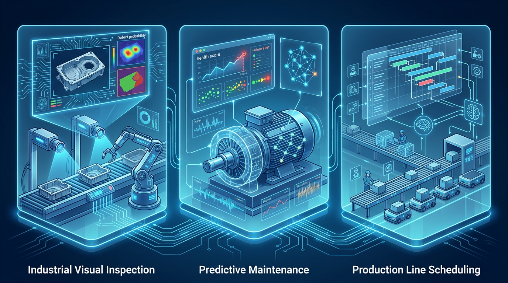

# 河南AI从业者解读刘宁书记文章：五个关键信号

这两天，很多人都在转刘宁书记那篇文章。读完之后，我的感受很直接：这不是一篇表态文，而是一份项目施工图。

对河南做人工智能、做数智化转型的人来说，最关键的不是又提了AI，而是它把一件事说透了：未来拼的不是谁会讲概念，而是谁能把项目做成结果。

## 一句话判断：河南AI项目，正在从演示型进入交付型

关键词很明确：先进制造业、产业链现代化、智改数转、人工智能加、场景复制。

评价标准也在变化：

- 以前看有没有平台、模型、系统；
- 现在更看良率提升、成本下降、交付周期缩短、风险降低。

河南这波AI机会，已经进入算账时代。

## 五个关键信号

### 1）AI必须贴着制造业主战场打

方向非常实：装备制造、新能源与智能网联汽车、新材料、生物医药、低空经济与航空航天。

制造业场景最容易形成闭环：质检、排产、设备预测维护、能耗优化、供应链协同，都是能验收、能复盘的。

### 2）智改数转已经不是加分项，而是生存项

企业普遍存在四个痛点：不会转、不能转、不愿转、不敢转。

服务商打法必须变：

- 不只是卖软件，而是卖轻量化、分阶段、可验收方案；
- 不只是做上线，而是做指标改善；
- 不只是单点应用，而是流程打通。

### 3）人工智能加的重点是垂直，不是泛化

重点是行业垂直模型和成熟场景复制，不是做演示项目。

更现实的路径是先打穿一个窄场景，再在同链条、同园区复制。

### 4）两业融合带来新机会

制造业向制造加服务转型，拼的是综合能力：

- 工业知识
- 数据治理
- 算法能力
- 流程改造
- 运维服务

最终交付的是持续运行、持续增效的系统。

### 5）园区将成为数智化放大器

园区改革强调标准化、专业化、市场化、精细化。

单企业项目会继续有，但园区级、链条级项目会加速。谁先形成可复用模板能力，谁就更容易拿到批量订单。

## 结语

河南不缺政策，不缺市场，不缺场景。真正稀缺的是把政策翻译成项目、把项目做成结果、再把结果做成可复制能力的人。

方向已经给了，接下来拼执行。

作者：余炜勋

原文标题：构建以先进制造业为骨干的现代化产业体系，为制造强国网络强国建设贡献河南力量
原文说明：原文可在权威公开渠道检索查看。
