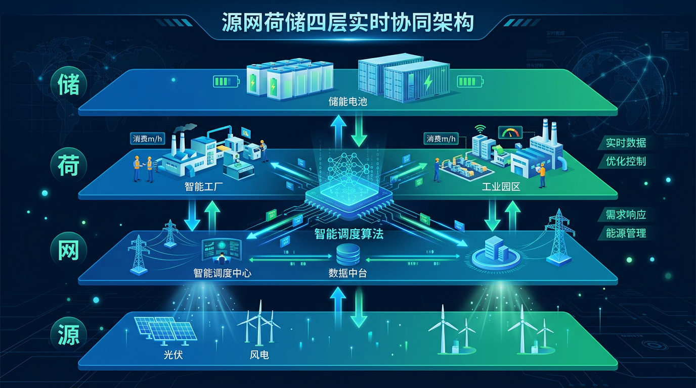
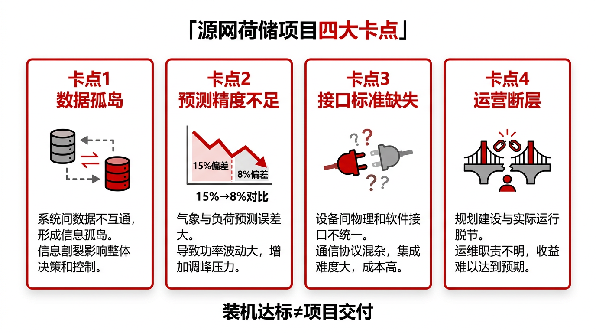
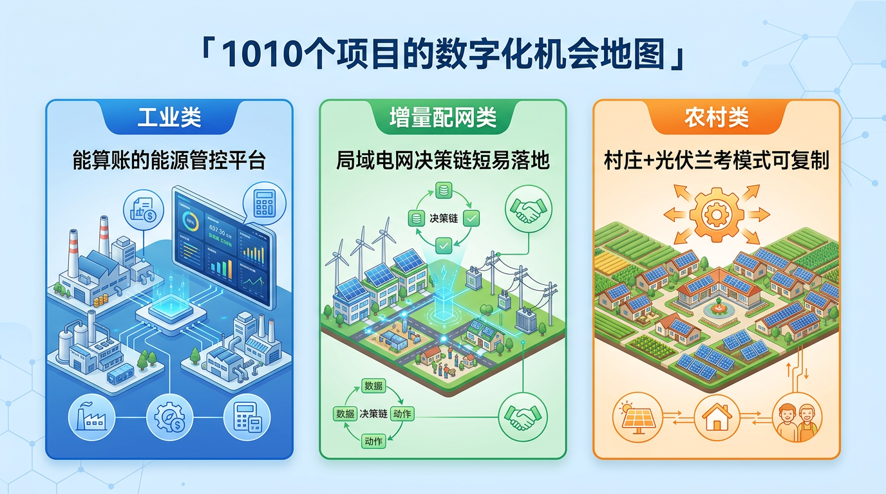
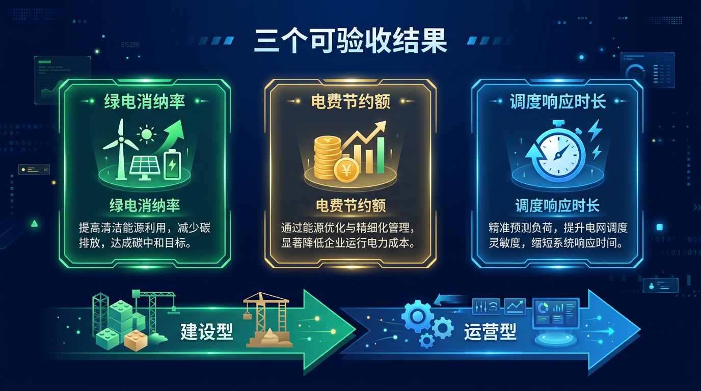

河南刚做完一件在全国算得上大手笔的事：四批次、192个源网荷储一体化项目、总投资约290亿元落地。绿电年均消纳80亿度，用电成本每年减少12亿到18亿元。

然后，2024年12月，省里又发了一份方案，一口气安排了**1010个**新项目。

外界第一反应通常是：这规模够大了。

但真正在这个赛道里做事的人，心里会有另一个问题：**装机容量不是瓶颈，数字化能不能跟上，才是这1010个项目能不能真正跑起来的关键。**

## 一、源网荷储的信息化在做什么

"源网荷储"四个字，对应四个物理层：发电侧（光伏、风电、余热等）、电网侧、用电负荷侧、储能侧。

把这四层整合起来不难，难的是**让这四层实时协同**——储能什么时候充，什么时候放；负荷什么时候响应，让多少；源端出力明天大概是多少，今晚的调度策略怎么定。

这件事靠人来判断，是做不了的。靠系统，但系统之间数据不通，也是白搭。

这就是信息化的核心工作：**把四层的实时数据打通，用算法生成调度策略，用平台闭环执行与反馈。**

河南已经有了真实的验证案例。

2026年1月9日投运的河南油田"源网荷储"一体化智慧能源管控平台，接入了变电站、风电、光伏、储能等多源数据，通过智能算法优化储能充放电策略，最大化绿电消纳，同步增强了电网可靠性与经济性。这是工业场景下源网荷储信息化平台的典型形态。

在更大范围内，国网河南电力2025年完成企业级数据中台建设，实现全省发电、输电、配电、用电各环节数据的集中治理与贯通融合。2025年夏季用电高峰，依托实时汇聚的风光出力预测、负荷平衡管理与储能状态数据，河南电网单日最大新能源消纳能力突破**4000万千瓦**，利用率同比提升0.7个百分点。

数据治理，直接决定消纳能力上限。

## 二、当前卡点：为什么很多项目"装了设备，用不起来"

192个项目的经验也证明了一件事：**装机容量达标，不等于项目交付。**

真实的卡点有四个。

**第一，数据孤岛没解决。** 光伏逆变器、储能BMS、配电自动化系统、负荷监控系统，往往是不同厂商、不同协议、不同数据格式。系统各自建，数据进不了同一个平台，调度优化就成了空谈。很多项目建完之后，能源管控室大屏点亮了，但屏幕上的数据是孤立的，不能联动，不能决策。

**第二，预测精度不够用。** 源网荷储的调度核心是预测——明天光伏出力多少、工厂负荷曲线怎么走、储能要提前几个小时开始充。预测不准，策略就乱。河南某示范项目引入"气象—负荷"双因子预测模型后，日负荷预测误差从15%降至**8%**，周预测误差从20%降至12%，自发自用率提升至78%。这意味着什么？误差从15%到8%，不只是精度提升，是整个系统调度逻辑的可行性门槛。多数项目还停留在15%以上，连基础调度策略都跑不稳。

**第三，接口标准缺失。** 1010个项目覆盖工业、农村、增量配网三类场景，涉及数十家设备厂商、数十套系统。没有统一的接口规范和数据标准，每个项目都要做一次定制化集成，成本极高，质量也无法保障。今天做成了，换个厂商或新增设备，又得推倒重来。

**第四，运营能力断层。** 这是最容易被忽视、也最致命的一个问题。很多项目在验收节点就断了——建设团队撤场，运营团队没有接进来；或者运营团队缺乏数据分析能力，平台装了但参数从来没优化过。三个月后，绿电消纳率和预期差一截，电费节约额不达标，甲方满意度直线下降。

这四个卡点，本质都指向同一件事：**源网荷储的信息化不是"上一套系统"那么简单，它需要数据治理、算法、集成、运营四层能力同步到位。**

## 三、1010个项目的数字化机会在哪里

这1010个项目，按场景分三类，机会各不相同。

**工业类是最大的盘子，也是数字化深度最高的场景。**

河南191个工业类项目（老项目131个，新增继续扩大），面向的是工厂、产业园区这类有稳定、大体量用电负荷的场景。这类场景的核心需求是：绿电自发自用比例最大化，电费最优化，同时满足安全生产要求。

这里需要的，是一套真正能"算账"的能源管控平台——实时监测+负荷预测+储能调度+电费结算一体化。光有SCADA不够，光有大屏不够，要能输出"今天这么调比昨天省了多少钱"的可量化结果。

**增量配网类是周期最短、甲方决策链最短的入口。**

增量配电网是新建的局域配电网，不挂在大电网体制内，决策相对灵活，对新技术、新模式接受度更高。这类项目天然需要独立的调度平台和数据治理架构，是信息化方案最容易完整落地的场景。

**农村类体量分散，但"兰考模式"提供了可复制的路径。**

兰考县作为全国首个农村能源革命试点县，探索出了"分布式光伏+储能+微电网"的完整闭环。付楼村案例更具体：屋顶光伏、储能系统、电动农机、智能灌溉统一接入，储能在充足时存电、在高峰或阴雨天放电。这个模式的数字化核心是**轻量化的能源管理系统**——功能够用、部署简单、运维成本低。农村场景不需要大型工业平台，需要的是适配小体量、多节点、分散安装的软件方案。

## 四、谁能接住这波机会

直接说结论：**不是卖设备的，不是做大屏的，是能把"平台+数据+运营"做成闭环的。**

机会不在设备端，设备已经充分竞争，利润率被压得很薄。机会在系统集成之后那一段——数据治理、调度优化、持续运营、效益验证。

这段工作，很多设备厂商做不了，因为没有数据治理能力；很多纯软件公司也做不了，因为没有现场集成经验。两头都靠的，才是真正的机会窗口。

从"三个可验收结果"倒推，是最务实的切入方式：

**绿电消纳率**——项目建成后，光伏发出来的电，有多少比例真正被自己用掉了，没有白白弃掉或低价上网。这是最直接的经济价值指标。

**电费节约额**——对工业用户来说，每年实际少交了多少电费，是最容易被甲方财务确认的数字，也是最有说服力的续约理由。

**调度响应时长**——从源端出力变化到储能/负荷侧完成响应，中间的延迟有多长。这是系统稳定性和可靠性的核心指标，也是区分"能用"和"好用"的分水岭。

这三个指标如果都能在项目验收文件里写清楚、在运营过程中持续可测，项目就从"建设型"转向了"运营型"——有持续数据、有持续优化、有持续价值，续约和扩展才有底气谈。

## 写在最后

河南已经是全国源网荷储项目体量最大的省份之一。290亿投资和1010个新项目，不是数字游戏，是真实的产业升级动作。

但产业升级的果子，不会自动落到装机量最大的人手里。

**能接住这波机会的，是那些能把数字化做成可验收结果的团队**——不是方案最漂亮的，不是PPT最厚的，是能坐在甲方财务室里，翻出去年电费单，跟今年对账的。

河南源网荷储的数字化这道关，不难看清楚，难的是有没有人愿意扎扎实实地去接。

---

*数据来源：河南省发展改革委（截至2024年11月4日数据）/ 《关于印发河南省加快推进源网荷储一体化实施方案的通知》（2024年12月）/ 中国石化新闻网（河南油田智慧能源管控平台，2026年1月）/ 人民日报中国能源报（国网河南电力数字化转型，2026年1月）/ 中国电力网（河南源网荷储分布式光伏深度报道，2025年1月）【来源：外部资料】*
