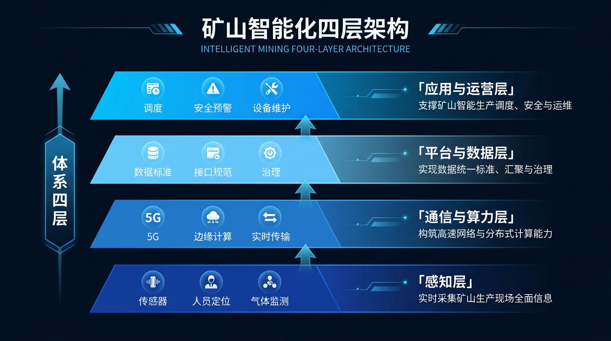
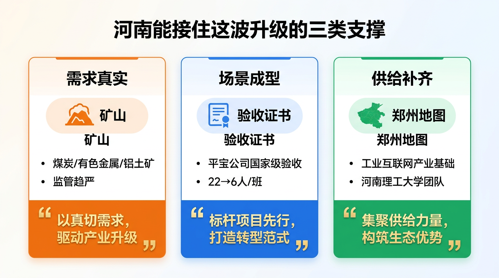
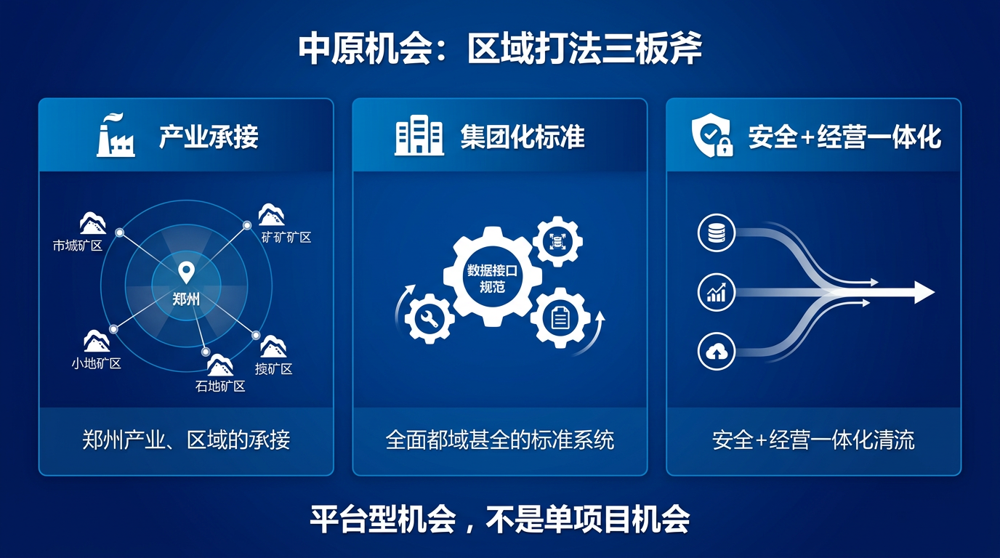
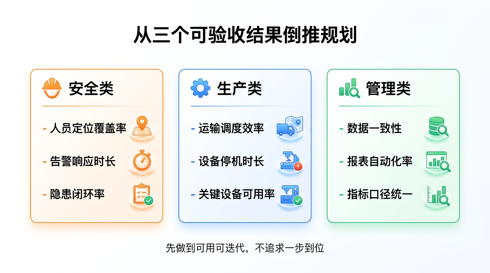

很多人一提"矿山智能化"，下意识觉得那是山西、内蒙的事，河南顶多跟着热闹一下。这个判断不但偏了，而且会让本地政企客户错过一波很实在的产业升级窗口。

先把话说透：矿山智能化不是"买几台设备、上个大屏"——它是一条能拉动设备更新、网络与算力、数据治理、安全生产体系、运营组织能力整体升级的产业链。更重要的是，这条链条里，河南不只"有矿"，也正在形成"能把项目做成体系交付"的条件。**中原不是旁观者。**

为什么这么说？因为河南已经出现了"国家级验收"的示范矿井，而且有明确的减人提效数据。

2023年2月27日，权威专家组对中国平煤神马集团平宝公司开展国家首批智能化示范煤矿现场验收，认为其达到Ⅱ类井工煤矿中级智能化示范煤矿建设水平。数据说话：单班作业人员由22人减至6人，效率提升30%以上；通风、供电、排水等系统全面实现无人值守，减少岗位用工156人，年均节省资金1800余万元。

这不是"概念展示"，是已经验收的工程能力。

## 一、矿山智能化升级的不是"设备"，而是"体系"

矿山智能化的核心目标，表面是"少人化、无人化、少事故"，本质是把矿山变成一个可感知、可计算、可调度、可追溯的生产系统。

四层结构缺一不可：

**感知层——让矿山"看得见"。** 人员、设备、气体、水害、地压等数据的持续采集是基础，没有稳定数据，后面所有"AI"都容易变成演示。

**通信与算力层——让数据"跑得动"。** 矿井环境对网络、边缘计算、实时性要求极高，断一下就可能是安全事故，这是硬约束不是软需求。

**平台与数据层——让系统"连得上"。** 上平台不是目的，关键是数据标准、数据治理、接口规范。很多项目烂尾，往往烂在"系统一堆、数据不通、责任不清"。

**应用与运营层——让生产"管得住"。** 调度、通风、排水、设备预测性维护……这些应用要落到班组、岗位、考核、流程里。矿山智能化最终拼的是"运营权"，不是"展示效果"。

## 二、河南凭什么能接住：三类支撑

**需求真实：资源禀赋决定"必须做"。** 河南是全国重要的煤炭、有色金属、铝土矿产地，矿山生产与安全监管需求长期存在。监管趋严、成本压力、人员结构变化持续发酵，智能化就是必然方向。

**场景成型：不缺"能验收的样板"。** 除平宝公司的国家级示范验收外，河南本地矿业集团在综采、监测、预警等关键场景持续推进智能化建设。平煤集团旗下首山一矿被列入全国首批国家级智能化示范煤矿，郑州高等研究院（河南理工大学）团队与平煤集团联合调研开展综采工作面大数据融合与预警研究，说明河南不是"没场景"，而是"场景正在被工程化"。

**供给补齐：郑州有能力形成"服务半径"。** 矿山智能化是"工业互联网+能源数字化+安全生产数字化"的交叉。郑州在工业互联网方面的产业基础，叠加河南理工大学郑州高等研究院煤矿智能化开采团队（80余项科研课题、50项发明专利、11项标准工法），说明河南具备"本地化交付与运维"的能力雏形。问题不是"能不能做"，而是"谁来把它组织成可交付的服务体系"。

## 三、中原机会不在"矿端项目"，在"区域打法"

单纯做矿端项目，河南会陷入跟随。但如果把它当成"区域产业升级抓手"，机会就完全不同。

**产业承接。** 矿山智能化涉及传感器、通信、边缘计算、工业软件、运维服务等多个环节。郑州的机会在于把相关企业与交付团队组织起来，形成面向周边矿区的服务半径与协同交付能力——这是平台型机会，不是单项目机会。

**集团化标准。** 很多矿企的痛点不是缺系统，而是缺标准：不同矿、不同承包商、不同系统导致数据不可比、管理不可控。谁能推动集团化的数据标准、接口规范、运维体系，谁就握住长期价值。

**安全+经营一体化。** 矿山智能化早期往往先做安全，再做生产，再做经营。真正的升级是把安全数据、生产数据、能耗数据用同一套指标体系贯通。这类项目最考验综合交付能力，也最容易形成护城河。

## 四、落地建议：从"三个可验收结果"倒推

很多项目推进失败，不是技术不行，而是目标不可验收。建议从三类结果倒推规划：

**安全类——风险可量化、隐患可闭环。** 例如：人员定位覆盖率、关键区域告警响应时长、隐患闭环率。别一上来追求100%，先做到可用、可持续迭代。

**生产类——关键环节可调度、产能更稳定。** 例如：运输调度效率、设备停机时长下降、关键设备可用率提升。

**管理类——数据能对账、过程可追溯。** 例如：系统间数据一致性、生产报表自动化率、关键指标口径统一。

只要这三类结果能验收，项目就能从"展示型"转向"运营型"，后续扩展越来越顺。

## 五、写在最后

河南接住这波产业升级，靠的是把政策与趋势翻译成可落地项目包，再把项目包落成可验收结果。

真正能吃到红利的，不是讲概念最响的，而是能把**咨询规划、系统集成、产品选型、数据治理、运维运营、项目投融资**串成闭环的团队。

如果你还在观望，不如先做一件小事：把你能交付的"矿山智能化最小项目包"框架写出来——目标、范围、系统清单、验收指标、运维机制。哪怕先从一个矿、一条运输线、一个安全场景开始，只要可验收，就能滚起来。

**中原不是旁观者，关键是你敢不敢先站出来接单。**

---

*数据来源：平宝公司国家首批智能化示范煤矿验收相关报道 / 河南工程学院矿山智能化团队调研报告 / 河南理工大学郑州高等研究院官网*
