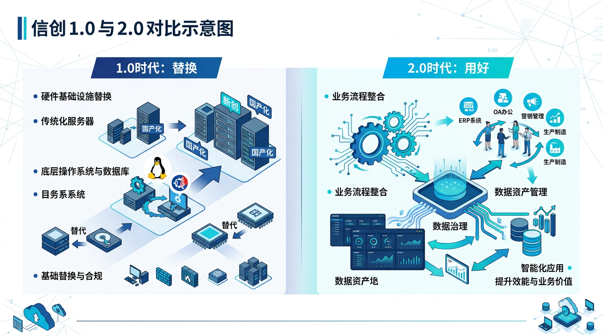
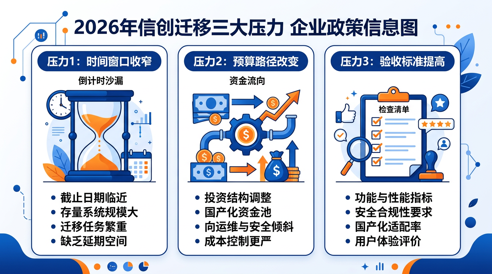
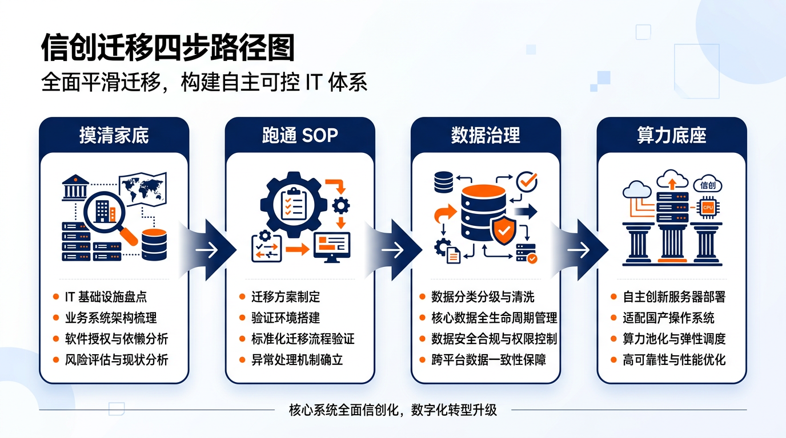

# 信创进入"2.0时代"，河南企业该怎么接这波红利？

很多人对信创的印象，还停在"把 Windows 换成麒麟、把 Oracle 换成达梦"这个层面。

这是信创 1.0 的思路。

**2026 年已经不够用了。**

国资委 79 号文白纸黑字：到 2027 年，央企、国企、地方国企完成信创替代的比例要达到 100%，覆盖芯片、基础软件、操作系统、中间件等全部核心领域。

现在是 2026 年 3 月。

留给"认真迁移"的时间，只剩不到两年。

---

## 一，1.0 和 2.0 的区别，在这里

信创 1.0 解决的是"有没有"：

> 有没有国产操作系统？有。有没有国产数据库？有。有没有国产 CPU 的服务器？有。

但采购了、部署了，很多单位发现一个问题：

**系统跑起来了，但业务跑不顺。**

原因是多方面的：

- 部分国产软件接口和原有业务系统不完全兼容，要改代码
- 迁移方案照搬旧架构，没有趁机优化，换了一套"同样慢的系统"
- 人员培训滞后，IT 部门自己都没用熟，更别说带动业务部门

这是"替换完成"和"用好"之间的鸿沟。

信创 2.0 的核心问题变了：

> 怎么在不崩业务的前提下完成迁移，同时让新系统真正比旧系统好用？

这是个工程问题，也是个管理问题。

---

## 二，2026 年的三个真实压力

**压力1：时间窗口在收窄**

2023 年开始推的第一阶段（OA、邮件、协同办公）大多数已经完成。现在进入第二阶段：核心业务系统（ERP、财务、项目管理）和数据库的迁移。

这部分的难度远高于第一阶段，因为它直接连着经营数据和考核指标。

**压力2：预算路径在变**

过去信创项目多半走"专项资金"，现在越来越多地要求"自筹+配套"。这意味着企业需要把信创投入纳入正常 IT 预算，并证明它对业务有回报。

光说"合规要求"已经不够，得讲清楚"做完了能干什么"。

**压力3：验收标准在提高**

监管层对信创替代的验收从"填表申报"转向"实质性运行"：系统要跑在国产硬件上、数据要存在国产数据库里、核心业务要切实跑通，而不是备用系统挂着国产标签。

---

## 三，河南企业的现实路径

结合河南区域的实际情况——省管集团、地方国企、市属平台公司分布广、层级多、信息化基础参差不齐——我建议按以下顺序来做：

### 第一步：摸清家底，别急着采购

很多单位还没搞清楚自己有多少系统在跑、哪些系统真的在用、哪些系统是历史遗留——就开始招标了。

结果：买了一堆国产软件，和现有系统接不上，项目陷入僵局。

**先做一次 IT 资产梳理**，把系统按"核心业务 / 支撑管理 / 历史存档"分三类，优先级排出来。核心业务系统最后迁，支撑管理系统先练手。

### 第二步：先在低风险系统跑通迁移 SOP

选一个业务影响最小的系统做迁移试点（比如内部 OA、门户网站），把整套流程走一遍：

- 兼容性测试
- 数据迁移验证
- 业务人员试运行
- 问题修复与回退方案

**这套 SOP 跑通了，后续核心系统的迁移才有底气。**

没有这一步直接上核心系统，风险极高。

### 第三步：数据库迁移要配套数据治理

这是最容易踩坑的环节。

把 Oracle 数据直接导入达梦或 GaussDB，技术上能做到，但很多单位发现跑出来的结果"对不上"——不是数据库的问题，是原来的数据本身就乱，口径不统一、历史脏数据没清。

**趁迁移的机会做一次数据治理**，是成本最低的时机。迁过去之后再治，代价是现在的三倍。

### 第四步：算力底座和业务系统要同步规划

信创不只是软件替换，还包括硬件国产化。如果底层算力平台（服务器、存储）还在用进口设备，上层的软件信创是局部合规，不是完整合规。

郑州区域有国家超算中心（郑州）、中原算力集群等资源，洛阳、许昌、新乡等地也在布局区域算力节点，可以借用公共算力资源降低自建成本，不一定全部自建。

---

## 四，可验收的结果，长什么样

做完信创不是交一份迁移报告就结束，验收要能回答这几个问题：

| 维度 | 可验收指标 |
|---|---|
| 系统运行 | 核心业务在国产硬件+软件上稳定运行（连续 30 天无重大故障）|
| 数据安全 | 核心数据存储在国产数据库，备份策略完整 |
| 业务连续性 | 迁移前后核心业务响应时间变化 ≤ 10% |
| 人员适配 | IT 运维人员完成国产系统认证培训 |
| 合规文件 | 可出具完整的信创替代清单和验收报告 |

这五项能对答，才算真正做完了。

---

## 五，这波红利，怎么接

信创不是负担，是一次被政策倒逼的系统性升级机会。

做得好的企业，会在这个过程里顺带完成 IT 架构现代化、数据治理补课、业务流程梳理——这些本来就该做、但一直没动力做的事。

做得差的企业，会花一笔钱换一套"看起来合规"的系统，然后继续用 Excel 和微信群管业务。

区别不在预算，在于有没有人把这件事当成业务问题来做，而不只是 IT 问题。

河南有 18 个地市、数百家省市两级国企平台、若干央企驻豫单位，都在这个节点上承压。信创不是郑州一个城市的事，是全省国有经济体系的一次系统性换血。

2026 年是最后一个主动布局的窗口——等到 2027 年监管验收时再动，只剩被动应付。

**迁移不难，难的是迁得有价值。**

---

*作者：余炜勋 | 寰曜数能*
*聚焦政企数字化转型与智能升级，覆盖河南全域 G/B 端客户，欢迎探讨具体落地路径。*
