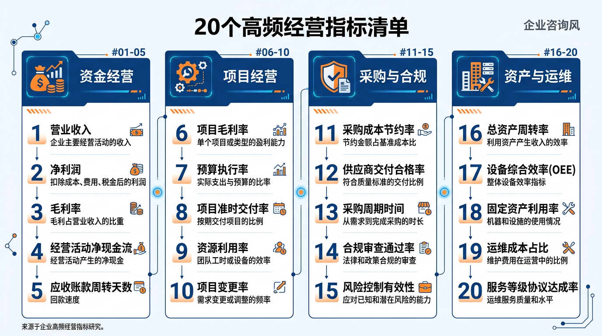
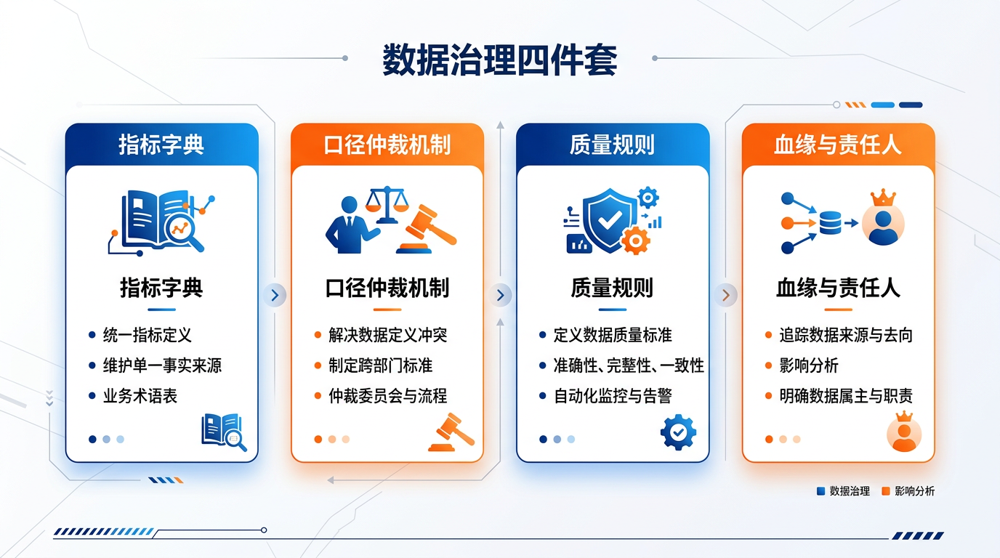
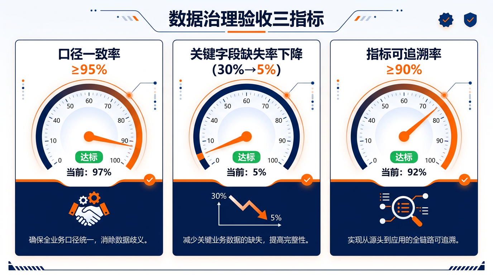

# 数据治理不是“建中台”：河南国企最该先统一的20个指标清单

很多河南国企这两年都做过“数据治理”。

上过数据中台、建过主数据、做过大屏，也写过一堆制度。

但只要你去现场问一句：

“同一个指标，你们财务、业务、审计三边是不是同一个口径？”

十有八九会卡住。

**这就是为什么很多单位看起来“数据很全”，但关键决策依然靠人拍板。**

因为数据治理最关键的第一步没做好：

> 先把高频经营指标口径统一。

（这也是我在《国企信创不是换设备：2026必须一起做的“算力+数据+流程”》里反复强调的那条底层逻辑：先统一20个高频经营指标口径，再谈质量规则与场景映射。）

---

## 一，为什么“指标口径不统一”会直接拖垮数字化

你以为指标不统一只是“数据对不上”，其实它会带来三类更致命的后果：

1）**决策不可复现**：今天开会拍板是 A，明天换一份口径又变 B，没人敢背书。

2）**责任不可追溯**：数据错了不知道该找谁，是系统问题、填报问题，还是业务定义本来就不清？

3）**AI 不可落地**：模型最怕“标签不稳定”。指标口径不稳定，训练再多也只能学到噪声。

所以这事儿要反过来做：

> 先把指标标准件做好，再谈平台和智能化。

---

## 二，河南国企先统一的“20个指标”长什么样

不追求全量，先追求“高频 + 高价值 + 牵引强”。

我建议按 4 类来选：资金、项目、采购、资产。

### A类（资金经营）
1. 合同额（含口径：含税/不含税、是否含变更）
2. 开票额
3. 回款额
4. 应收账款余额
5. 逾期应收占比

### B类（项目经营）
6. 在建项目数
7. 项目完工率
8. 项目延期率
9. 项目成本偏差率（预算 vs 实际）
10. 关键里程碑达成率

### C类（采购与合规）
11. 采购预算执行率
12. 招采周期（从立项到定标）
13. 供应商准入通过率
14. 采购节约率（中标价 vs 预算）
15. 合规预警闭环率（发现→处置→回写）

### D类（资产与运维）
16. 固定资产台账一致率
17. 资产闲置率
18. 设备完好率
19. 关键设备停机时长
20. 运维工单按期关闭率

你会发现，这 20 个指标有一个共同点：

- 都是“经营要害”
- 都能拉出责任链
- 都能做验收

---

## 三，把指标做成“标准件”：四件套缺一不可

很多单位卡在这里：指标列出来了，但依旧用不起来。

因为缺少下面这四件套。

### 1）指标字典（Definition）
明确：指标名称、业务定义、统计范围、计算公式、时间口径、组织口径。

一句话：**谁都能按同一套规则算出来。**

### 2）口径仲裁机制（Decision Rights）
指标冲突一定会发生：财务强调审计口径，业务强调经营口径。

必须明确：

- 谁负责提出版本
- 谁负责拍板
- 谁负责发布
- 谁负责变更留痕

没有仲裁机制，口径永远统一不起来。

### 3）质量规则（Quality Rules）
至少三类规则先落地：

- 完整性：关键字段缺失率
- 及时性：T+0/T+1 的更新要求
- 准确性：抽样对账、异常阈值

### 4）血缘与责任人（Lineage & Owner）
每个指标必须能追到：

- 数据从哪个系统来
- 中间怎么加工
- 谁是 Owner（业务负责）
- 谁是 Steward（数据负责）

做不到这一步，“数据出错”就只能变成互相甩锅。

---

## 四，怎么验收：别再验收“平台功能”，验收“口径一致”

建议用三个硬指标做验收：

1）核心指标口径一致率（≥95%）

2）关键字段缺失率下降（例如 30%→5%）

3）指标可追溯率（血缘可查、责任人明确，≥90%）

这三项过了，再谈“上中台、上大屏、上AI”，才不会变成表面工程。

---

## 五，一句话结论

数据治理不是从“建中台”开始的。

河南国企要想把数字化做成“能验收、能穿透、能持续”，第一步就是：

**先把这 20 个高频经营指标，做成可复用、可追责、可验收的标准件。**

后面的平台、AI、看板，才有地基。

---

*作者：余炜勋 | 寰曜数能*
*聚焦政企数字化转型与智能升级，覆盖河南全域 G/B 端客户，欢迎交流指标体系与落地路径。*
