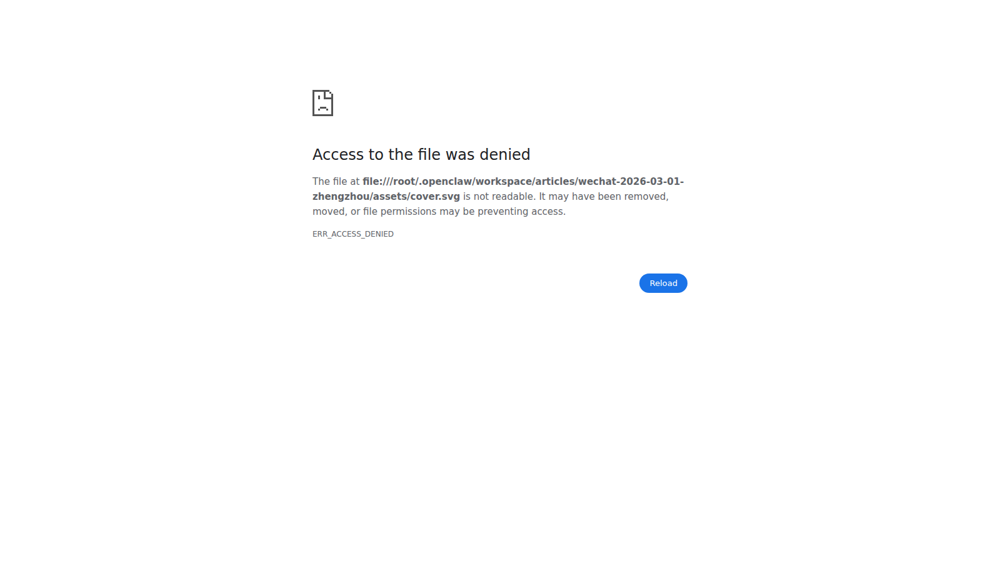
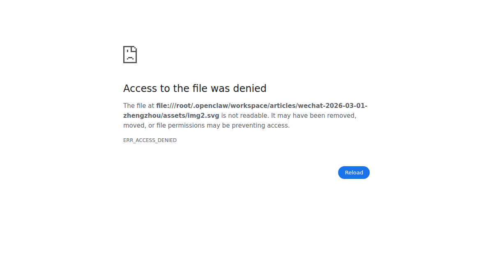
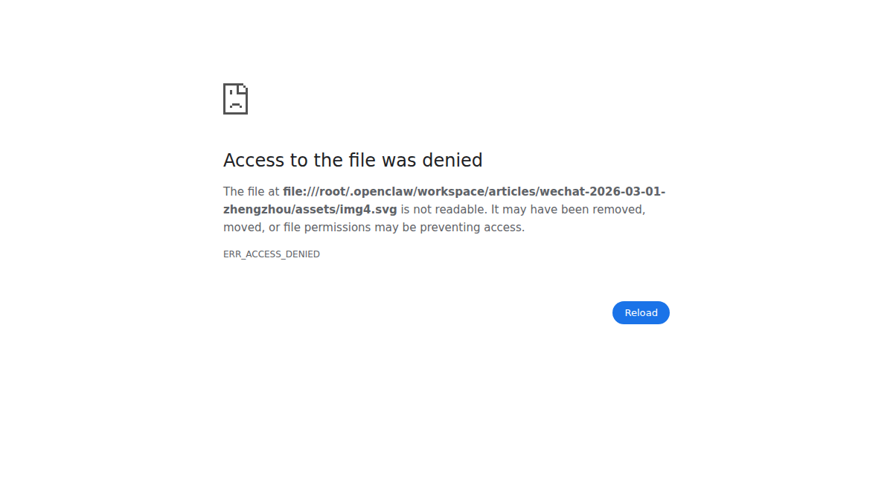

# 郑州“算力逆袭”真相：不是风口，是一条430亿产业链

这两年，“算力”成了最热词之一。  
但在很多城市，算力还是“概念”；在郑州，它正在变成“产业”。

为什么这么说？  
因为一个很硬的信号摆在面前：**2025-04-16 超聚变探索者大会上，超聚变董事长刘宏云提到，公司 2024 年营收约 435 亿元**。这不是一条企业新闻，而是一个城市产业路径被验证的证据。

如果把这件事拆开看，会发现郑州的变化不是偶然，而是“政策 + 基础设施 + 龙头牵引 + 场景落地”共同作用的结果。

## 一、郑州的变化，不是“突然起飞”，而是“长期蓄力后拐点显现”

很多人对郑州的印象还停留在“交通枢纽”。  
但今天，郑州正在从“货运枢纽”升级为“数字枢纽”。

这种升级背后有三个底层支撑：

1. **区位与通道能力**：交通、网络、能源等基础条件完整；
2. **制造业底盘**：产业门类全，配套能力强，能承接算力硬件与系统集成；
3. **政策与组织推动**：把算力放进现代化产业体系，而不是当成孤立项目。

说白了，郑州不是在追一个热点，而是在补一块“下一轮产业竞争的底板”。

## 二、从“约435亿元”看郑州算力产业，为什么是城市级信号？

因为这代表三层含义：

### 1）需求被验证了
如果没有真实订单和行业场景，规模不可能持续放大。约435亿元不是“估值故事”，是需求故事。

### 2）产业链被牵引了
龙头企业跑起来，带动的不只是自己：整机、液冷、供配电、运维、软件、服务都会被拉动。

### 3）城市能力被重估了
企业增长会倒逼城市升级：电力保障、网络时延、人才供给、政务效率都要跟上。

所以，真正重要的不是“哪家公司涨了”，而是**郑州具备了把算力变成产业组织能力的条件**。

## 三、郑州“算力之城”真正的竞争点，不在机房数量，而在闭环能力

只拼机房，谁都能建；  
拼闭环，不是谁都能做。

郑州要形成的是这条闭环：

**基础设施（算力）→ 行业场景（用力）→ 产业协同（放大）→ 持续投资（复利）**

如果闭环跑通，算力就不再只是成本中心，而是增长引擎。

这也是为什么我们看“算力之城”，不能只看参数，要看三件事：

- 算力利用率是否持续提升；
- 政企场景是否出现可复制案例；
- 本地产业链是否形成稳定协同。

## 四、对政企客户来说，算力的价值不在“算得多快”，而在“结果能不能交付”

政企客户最关心的，从来不是 GPU 型号，而是：

- 项目周期能不能缩短；
- 运营成本能不能下降；
- 系统是否安全、稳定、可持续；
- 是否能形成可验收、可复用的成果。

这也意味着，下一阶段比拼的重点会从“谁有算力”转向“谁能交付结果”。

**算力只是起点，行业解决方案才是终点。**

## 五、郑州下一步怎么走？关键看三件事

1. **从“建设导向”转向“运营导向”**：看利用率、交付效率；
2. **从“通用算力”走向“行业算力”**：看场景复制能力；
3. **从“单点突破”升级为“生态协同”**：看闭环交付能力。

谁先完成这三步，谁就不是“算力节点”，而是“算力中心”。

## 结语

“郑州怎么成了算力之城？”答案不是一句口号，而是一条路径：

**先有基础设施，再有龙头牵引，再有场景落地，最后形成城市级产业复利。**

“一家公司，约435亿元”只是开始。更值得关注的是：这座城市，正在把算力变成新的生产力组织方式。

---

> 口径说明：文中“约435亿元”来自 2025-04-16 超聚变探索者大会公开口径，发布时建议附具体报道链接，并标注“以公司正式披露为准”。
